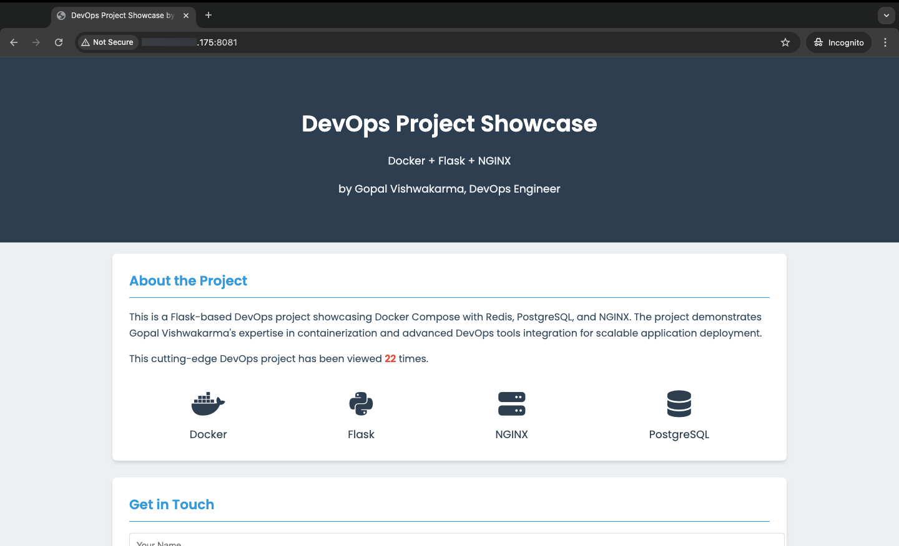
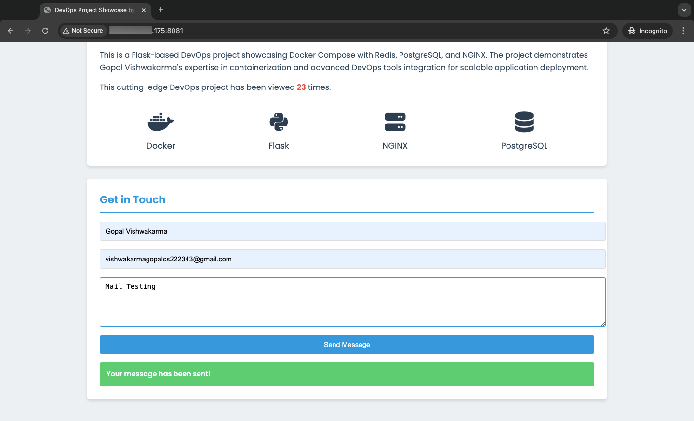

# DevOps Project Showcase

## Docker + Flask + NGINX + Redis + PostgreSQL on AlmaLinux

This project demonstrates a containerized web application setup using Docker, Flask, NGINX, Redis, and PostgreSQL, deployed on AlmaLinux. It's designed to showcase the skills of a DevOps fresher in containerization, web development, and database management.

## Table of Contents

1. [Prerequisites](#prerequisites)
2. [Project Structure](#project-structure)
3. [Setup and Installation](#setup-and-installation)
4. [Running the Application](#running-the-application)
5. [Monitoring and Logging](#monitoring-and-logging)
6. [Troubleshooting](#troubleshooting)

## Prerequisites

- AlmaLinux 8 or later
- Docker and Docker Compose
- Git

## Project Structure

```
.
├── app.py
├── docker-compose.yaml
├── Dockerfile
├── nginx.conf
├── requirements.txt
└── templates
    └── index.html
```

## Setup and Installation

### 1. Install Docker and Docker Compose

```bash
sudo dnf config-manager --add-repo=https://download.docker.com/linux/centos/docker-ce.repo
sudo dnf install docker-ce docker-ce-cli containerd.io docker-compose-plugin
sudo systemctl start docker
sudo systemctl enable docker
```

### 2. Install Git

```bash
sudo dnf install git
```

### 3. Clone the Repository

```bash
git clone https://github.com/your-username/devops-project-showcase.git
cd devops-project-showcase
```

### 4. Set Up Environment Variables

Create a `.env` file in the project root:

```bash
DB_USER=admin
DB_PASSWORD=admin
POSTGRES_DB=myapp
REDIS_HOST=redis
MAIL_USERNAME=your-email@example.com
MAIL_PASSWORD=your-email-password
```

## Running the Application

1. Build and start the containers:

```bash
docker-compose up -d --build
```

2. Check the status of the containers:

```bash
docker compose ps
```


3. Access the application at `http://your-server-ip:8082`




## Last output
Email Successfully sent


Email data Successfully saved in database


## Monitoring and Logging

### Viewing Logs

To view logs for a specific service:

```bash
docker-compose logs -f service_name
```

### Monitoring Container Health

```bash
docker compose ps
```

### Checking Resource Usage

```bash
docker stats
```


## Troubleshooting

- If the application is not accessible, check NGINX logs:

```bash
docker-compose logs nginx
```

- For database connection issues, verify PostgreSQL logs:

```bash
docker-compose logs db
```

- If the Flask app is not responding, check its logs:

```bash
docker-compose logs web
```

This project was created by Gopal Vishwakarma, a passionate DevOps Engineer.
